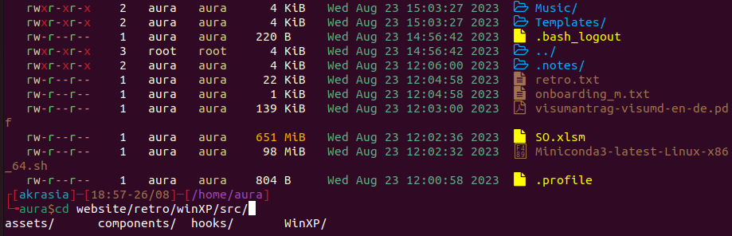

# zshrc-config

This repository contains a configuration file for the Zsh shell, `.zshrc`. This configuration is designed to enhance your terminal experience, minimizing the load on the user, including useful functions, aliases, plugins, and more. 

## Contents

The `.zshrc` configuration file includes:

- A custom greeting message and system information display using `neofetch`.
- A colorful and informative prompt.
- A custom `PATH` configuration.
- Functions for sourcing and editing the `.zshrc` file, and backing it up to Google Drive.
- A function for adding Zsh plugins.
- A function for creating a backup of a file.
- Functions for encoding and decoding hexadecimal strings.
- A function for applying the ROT13 cipher to a string.
- Configuration for auto-completion and suggestion features.
- Syntax highlighting configuration.
- History configuration.
- A large number of useful aliases for common commands.
- Keybindings for easier navigation and editing in the terminal.
- Variable declarations for dotfiles and API keys.

## Installation

### Linux

To use this configuration on a Linux system, follow these steps:

1. Ensure you have all of the necessary packages installed on your system. If not, you can install them using your package manager. For example, on Ubuntu, you would use `sudo apt install zsh git ruby ruby-dev ack neofetch yt-dlp zsh-syntax-highlighting zsh-autosuggestions fzf vim nano nvm python3 pip`.

2. Install the colorls gem. On Ubuntu, you can do this with `sudo gem install colorls`.

3. Clone this repository and zsh-autocomplete to your local machine using `git clone https://github.com/<username>/zshrc-config.git && git clone https://github.com/marlonrichert/zsh-autocomplete && sudo mv zsh-autocomplete /usr/share/`.

4. Copy the `.zshrc` file to your home directory using `cp zshrc-config/.zshrc ~/.zshrc`.

5. Change the default shell to be zsh using 'chsh -s $(which zsh)'

6. Source the new `.zshrc` file using `source ~/.zshrc`.

### macOS

To use this configuration on a macOS system, follow these steps:

1. Ensure you have Zsh and Git installed on your system. If not, you can install them using Homebrew with `brew install zsh git ruby ruby-dev ack neofetch yt-dlp zsh-syntax-highlighting zsh-autosuggestions fzf vim nano nvm`.

2. Install Ruby and the colorls gem. You can do this with `brew install ruby ruby-dev` and then `sudo gem install colorls`.

3. Clone this repository and zsh-autocomplete to your local machine using `git clone https://github.com/<username>/zshrc-config.git && git clone https://github.com/marlonrichert/zsh-autocomplete && sudo mv zsh-autocomplete /usr/share/`.

4. Copy the `.zshrc` file to your home directory using `cp zshrc-config/.zshrc ~/.zshrc`.

5. Source the new `.zshrc` file using `source ~/.zshrc`.

## Setting Up

Some parts of the configuration require additional setup:

- The `backupToDrive` function requires you to replace `<username>` with your actual username in the path to your Google Drive. This function copies the specified file to your Google Drive folder. Make sure you have Google Drive set up on your system and adjust the path in the function accordingly.

- The `zsh_add_plugin` function requires you to set `ZDOTDIR` to the directory where you want to store your Zsh plugins. This can be any directory of your choice. Once you've decided on a directory, set `ZDOTDIR` to its path like so: `export ZDOTDIR=/path/to/your/directory`.

- The configuration for auto-completion and suggestion features requires the `zsh-autosuggestions` and `zsh-autocomplete` plugins. You can install these using your package manager or manually from their GitHub repositories. For manual installation, clone the repositories into your `$ZSH_CUSTOM/plugins` directory, then add the plugins to your plugin list in your `.zshrc` file.

- The syntax highlighting configuration requires the `zsh-syntax-highlighting` plugin. You can install this using your package manager or manually from its GitHub repository. For manual installation, clone the repository into your `$ZSH_CUSTOM/plugins` directory, then add the plugin to your plugin list in your `.zshrc` file.

- The API keys at the end of the file should be replaced with your actual API keys.

- The `conda` command requires Anaconda to be installed on your system. You can download it from the [official website](https://www.anaconda.com/products/distribution) and follow the installation instructions there. For a minimal installation, consider using Miniconda instead.
